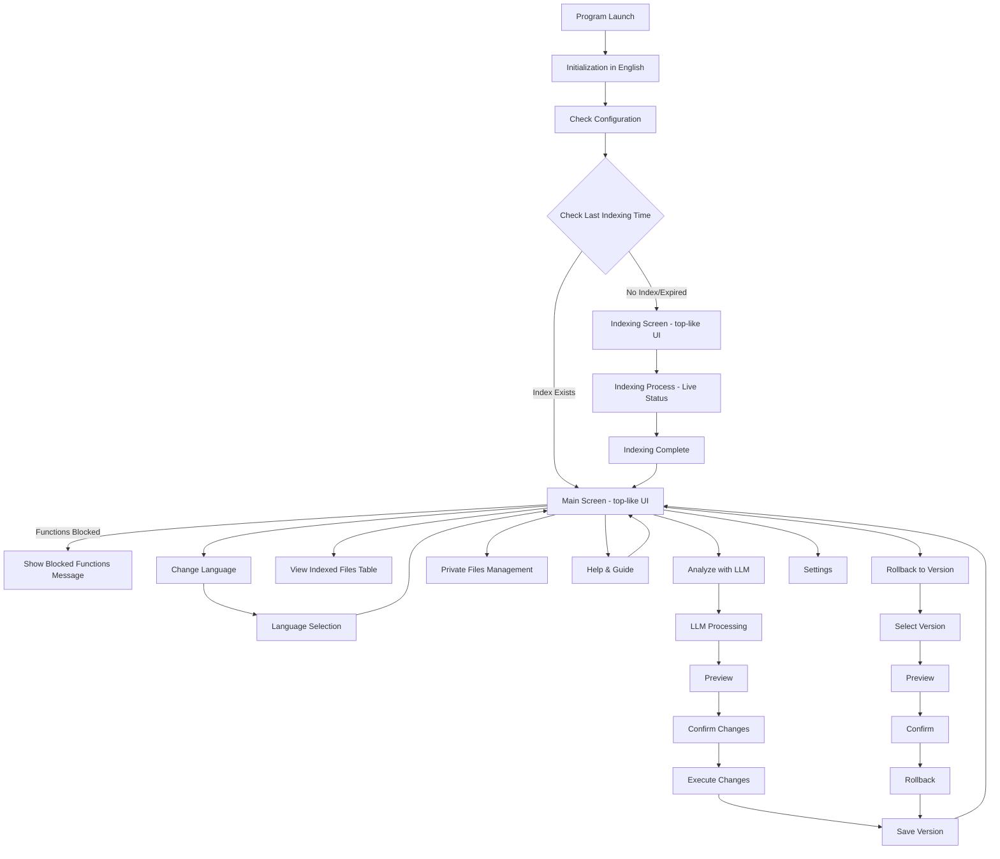
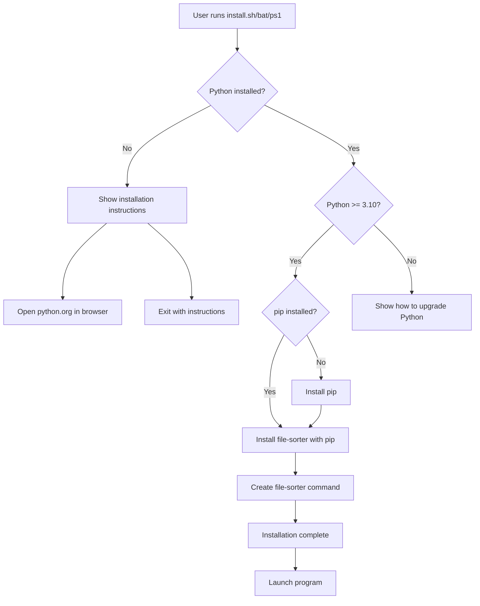

# File Sorter TUI System - Plan

## System Architecture



## Project Structure

```
File_Sorter/
├── src/
│   ├── __init__.py
│   ├── main.py                 # Main entry point
│   ├── tui/
│   │   ├── __init__.py
│   │   ├── app.py              # Textual main application
│   │   ├── screens/
│   │   │   ├── __init__.py
│   │   │   ├── main_screen.py  # Main screen - top-like UI with file table
│   │   │   ├── language_select.py  # Language selection (from main screen)
│   │   │   ├── indexing.py     # Indexing screen - real-time status, top-like UI
│   │   │   ├── analysis.py     # LLM analysis screen with privacy control
│   │   │   ├── preview.py      # Changes preview
│   │   │   ├── rollback.py     # Version rollback
│   │   │   ├── privacy.py      # Private files management
│   │   │   ├── help.py         # Help and guide
│   │   │   └── settings.py    # Settings
│   │   └── widgets/
│   │       ├── __init__.py
│   │       ├── file_table.py   # File table widget - sortable, filterable table
│   │       ├── status_header.py # Status header widget - top section with stats
│   │       ├── file_tree.py    # File tree display
│   │       └── version_list.py # Version list
│   ├── core/
│   │   ├── __init__.py
│   │   ├── indexer.py          # File indexing
│   │   ├── analyzer.py         # Surface-level file analysis (magic numbers, metadata, previews)
│   │   ├── llm_client.py       # LLM integration with privacy control
│   │   ├── file_operations.py  # File operations (move, rename)
│   │   ├── version_manager.py  # Version management
│   │   ├── privacy_manager.py  # Private files management and filtering
│   │   └── exceptions_manager.py # Exceptions system (directories/files/extensions to ignore)
│   ├── storage/
│   │   ├── __init__.py
│   │   ├── index_storage.py    # Index storage
│   │   ├── checkpoint_manager.py  # Checkpoint management and resuming
│   │   └── version_storage.py # Version storage JSON
│   ├── i18n/
│   │   ├── __init__.py
│   │   ├── translations.py    # Translation management
│   │   ├── lv.json            # Latvian language
│   │   ├── ru.json            # Russian language
│   │   └── en.json            # English language
│   └── utils/
│       ├── __init__.py
│       ├── config.py           # Configuration management
│       ├── logger.py           # Logging
│       ├── cli.py               # Command line argument parsing
│       ├── backup.py            # Backup and restore utilities
│       └── migration.py         # Data migration utilities
├── .file_sorter/               # Hidden directory (created in working directory)
│   ├── index.json              # Index data (may be split into multiple files for large directories)
│   ├── index_checkpoint.json   # Checkpoint for indexing (progress saving)
│   ├── index_lock              # Lock file to prevent parallel indexing
│   ├── versions/               # Version history (one version per operation)
│   │   ├── v1.json             # Compressed and optimized
│   │   ├── v2.json
│   │   └── ...
│   ├── config.json             # User configuration
│   ├── exceptions.json         # Private files/directories/extensions exceptions
│   └── logs/                   # Log files
│       ├── application.log
│       ├── errors.log
│       └── debug.log
├── requirements.txt
├── requirements-dev.txt        # Development dependencies
├── setup.py                    # Pip package configuration
├── pyproject.toml              # Modern package configuration
├── pytest.ini                  # Pytest configuration
├── .pre-commit-config.yaml     # Pre-commit hooks configuration
├── .ruff.toml                  # Ruff linting configuration
├── .mypy.ini                   # MyPy type checking configuration
├── pyrightconfig.json          # Pyright configuration (optional)
├── install.sh                  # Linux/MacOS installation script
├── install.bat                 # Windows CMD installation script
├── install.ps1                 # Windows PowerShell installation script
├── scripts/
│   ├── check_python.py         # Python version check
│   └── install_guide.py       # Instruction display
├── tests/
│   ├── __init__.py
│   ├── unit/                   # Unit tests
│   │   ├── __init__.py
│   │   ├── test_indexer.py
│   │   ├── test_analyzer.py
│   │   ├── test_llm_client.py
│   │   ├── test_version_manager.py
│   │   └── test_file_operations.py
│   ├── integration/            # Integration tests
│   │   ├── __init__.py
│   │   ├── test_indexing_workflow.py
│   │   ├── test_llm_workflow.py
│   │   └── test_rollback_workflow.py
│   ├── tui/                    # TUI tests
│   │   ├── __init__.py
│   │   ├── test_main_screen.py
│   │   └── test_indexing_screen.py
│   └── fixtures/               # Test fixtures
│       ├── sample_files/
│       └── mock_responses/
├── docs/
│   ├── user/                   # User documentation
│   │   ├── getting_started.md
│   │   ├── user_guide.md
│   │   └── faq.md
│   ├── developer/              # Developer documentation
│   │   ├── architecture.md
│   │   ├── api.md
│   │   └── contributing.md
│   └── api/                    # API reference
│       ├── core.md
│       └── tui.md
├── .github/
│   ├── workflows/              # GitHub Actions
│   │   ├── ci.yml              # Continuous Integration
│   │   ├── security.yml        # Security scanning
│   │   └── release.yml         # Release workflow
│   ├── ISSUE_TEMPLATE/         # Issue templates
│   │   ├── bug_report.md
│   │   └── feature_request.md
│   └── PULL_REQUEST_TEMPLATE.md
├── CHANGELOG.md                # Changelog
├── CONTRIBUTING.md             # Contributing guidelines
├── SECURITY.md                 # Security policy
├── LICENSE                     # MIT License
├── README.md
└── .gitignore
```

## Main Components

### 1. Indexing System (`core/indexer.py`)

- **Directory Selection and .file_sorter Creation:**
  - On program launch, creates empty `.file_sorter/` directory in current working directory
  - This marks that the tool has been run in this directory
  - By default, tool works only in the opened directory
  - If user opens a subdirectory, checks parent directories for existing `.file_sorter/`
  - If found in parent, offers to use that `.file_sorter/` instead
  - Each directory can have its own `.file_sorter/` or share parent's

- **Indexing only when TUI is opened:**
  - Indexing is **NOT automatic** - user must start it manually from TUI
  - On TUI launch, checks if indexing has been performed
  - If no index exists or indexing incomplete, functions are blocked until indexing is done
  - User clicks "Start Indexing" button to begin indexing process

- **Dynamic Indexing (Pause/Resume):**
  - Indexing can be paused at any time (Ctrl+C or pause button)
  - Progress is saved to checkpoint immediately
  - Can resume from exact point where paused
  - All program state saved quickly and correctly for fast resume

- **Indexing status check:**
  - Checks `index.json` for `indexed_at` timestamp
  - If no index exists: `indexing_status = "not_started"`
  - If indexing incomplete (checkpoint exists): `indexing_status = "in_progress"`
  - If indexing complete: `indexing_status = "completed"`
  - This status determines which functions are available

- **Efficient processing for large file counts (10000+):**
  - Batch processing - processes files in chunks (e.g., 100 files at a time)
  - Parallel processing with `concurrent.futures.ThreadPoolExecutor` (configurable thread count)
  - Real-time progress updates to TUI (every 100-500ms)
  - Optimized memory usage - does not store all files in memory simultaneously

- **Checkpoint system (resume after interruption):**
  - Saves checkpoint after each batch processing (`index_checkpoint.json`)
  - Checkpoint contains:
    - List of processed files (paths)
    - Progress (how many files processed, how many remaining)
    - Timestamp
    - Hash sums for processed files (to detect changes)
  - If program is interrupted, on next launch:
    - Checks for checkpoint existence
    - Shows resume option in indexing screen
    - Determines which files are already processed
    - Resumes from last checkpoint
    - Checks if files have changed (by hash)
    - Updates only changed files

- **Incremental indexing:**
  - After full indexing, saves file hash sums and modification dates
  - On next indexing run:
    - Quickly scans directory structure
    - Compares modification dates with indexed dates
    - Identifies changed files (modified date newer than indexed date)
    - Identifies deleted files (file no longer exists)
    - Identifies new files (not in index)
    - Updates index only with changed/new files
    - Removes deleted files from index
  - Fast comparison using dates first, then hash verification
  - Saves time and resources

- **Lock mechanism:**
  - Uses `index_lock` file to prevent parallel indexing
  - If program is interrupted, lock file is cleared on next launch

- **Recursive directory traversal:**
  - Recursively goes through all directories
  - Indexes file names, paths, sizes, dates
  - Calls `analyzer.py` for surface-level analysis
  - Saves results to `index.json` and checkpoint
  - Updates `indexed_at` timestamp when complete

### 2. Analysis System (`core/analyzer.py`)

- **Surface-level analysis - DOES NOT READ FULL FILES:**
  - Uses file magic numbers (first bytes) for file type detection
  - Reads only first 512-1024 bytes for text files (content preview)
  - Uses `python-magic` or `filetype` libraries for file type detection
  - File size and date information (without reading content)

- **Metadata extraction (only standard metadata, not file content):**
  - Images: EXIF data (date, camera, GPS - only if available)
  - Audio: ID3 tags (artist, album - only tags, not audio content)
  - Documents: only file type detection, not content
  - Archives: only structure, not content

- **Efficiency for large file counts:**
  - Parallel processing with `concurrent.futures.ThreadPoolExecutor` (configurable thread count, default 4-8)
  - Batch processing - processes files in chunks
  - Progress indicator with detailed information (files/s, remaining time)
  - Does not use more memory than necessary - does not store all files in memory
  - For text files reads only first lines (max 10-20 lines) for content preview
  - For large files (>10MB) skips content preview, only metadata
  - Optimization: similar files (by type) processed in groups

- **Checkpoint integration:**
  - Analysis results saved in checkpoint together with index
  - If analysis is interrupted, can resume from last checkpoint

### 3. LLM Integration (`core/llm_client.py`)

- **Privacy and security guarantees:**
  - **EVERYTHING stored locally** - nothing is sent without user permission
  - User can choose what to send to LLM:
    - Option 1: Structure only (file names, directory structure, file types)
    - Option 2: Structure + metadata (without file content)
    - Option 3: Structure + metadata + text file previews (only first lines)
  - **SENSITIVE FILES:** Files marked as private or matching exceptions are **NEVER** sent to LLM
  - Before sending to LLM - **clear warning** and **JSON preview** showing exactly what will be sent
  - User can review and edit JSON payload before sending
  - User can use local LLM (Ollama) - everything stays on computer

- **LLM Request/Response Preview:**
  - **Before sending:** Show exact JSON that will be sent to LLM
  - User can review payload structure
  - User can add custom instructions: "How should I organize these files into folders?"
  - User must explicitly confirm before sending
  - **After receiving:** Show LLM response
  - Validate response format matches expected structure
  - If response is incorrect or dangerous, request LLM to retry with clearer instructions
  - Option to save request/response locally (not prominent, but available)

- **LLM Instructions:**
  - User provides instructions on how to organize files
  - System instructs LLM to return data in specific format:
    - Short and concise response
    - Clear instructions on where to move files
    - How to rename files
    - JSON format only, no explanations in natural language (unless requested)

- **Supports multiple LLM providers:**
  - OpenAI (GPT-4, GPT-3.5) - BYOK (user provides API key, stored securely)
  - Anthropic (Claude) - BYOK (user provides API key, stored securely)
  - Ollama (local LLM) - **RECOMMENDED for privacy** (no API key needed)
  - **Custom LLM endpoint:** User can specify custom endpoint and connection parameters
  - User selects provider and provides API key (stored in config)
  - API keys persist across sessions

- **LLM Provider Selection:**
  - Default: Show only popular providers (OpenAI, Anthropic, Ollama)
  - User selects provider and enters API key
  - API key stored securely in config.json
  - Option for custom LLM endpoint:
    - User specifies endpoint URL
    - User specifies connection parameters
    - Stored in config for future use

- **Fallback Mechanism:**
  - If LLM request fails, show error message
  - Inform user they can choose different LLM provider
  - No automatic fallback - user must explicitly choose

- **Data sent to LLM:**
  - Only file/directory structure (names, types, sizes)
  - Metadata (without sensitive information)
  - User instructions/goals
  - **NEVER:** Full file content, sensitive information, private files, files matching exceptions

- **Returns JSON with recommendations:**
  - Move operations (source → destination)
  - Rename recommendations (old_name → new_name)
  - Directory creation recommendations
  - Response validated against expected format
  - If invalid, request retry with format instructions

### 4. Version Management (`core/version_manager.py`)

- **Version Creation:**
  - Every operation through the tool creates a new version
  - Version count = number of operations performed
  - Versions stored efficiently to avoid system overload
  - Large files avoided - only directory structure saved, not file contents
  - Versions compressed and optimized for storage efficiency

- **Version Storage:**
  - Each version stored in `versions/vN.json`
  - Versions compressed (gzip) to save space
  - Only stores directory structure (paths, names, types) - not file contents
  - LLM recommendations saved with each version
  - Timestamp and operation description included

- **Optimization:**
  - Incremental storage: only stores changes from previous version
  - Compression: gzip compression for version files
  - Cleanup: optional automatic cleanup of old versions (configurable)
  - Smart storage: large directories split into multiple version files if needed

- **Rollback Support:**
  - Full rollback: restore entire directory structure
  - Selective rollback: restore specific files/directories
  - Version comparison: show differences between versions

### 5. TUI Interface (`tui/app.py` and screens/)

- **Main Screen (`tui/screens/main_screen.py`) - "top" like interface:**
  - **Layout similar to Linux "top" command:**
    - **Top section (header):** System information and settings
      - Last indexing time and status
      - Total files indexed
      - Files processed / remaining
      - Current indexing status (if in progress)
      - System stats (memory usage, processing speed)
      - Quick actions (keyboard shortcuts visible)
    - **Bottom section (main area):** File list table
      - All indexed files displayed in table format
      - Columns: Name, Path, Type, Size, Status, Last Modified
      - Sortable columns
      - Filterable by type, status, etc.
      - Real-time updates during indexing
      - Scrollable list
  
  - **Indexing Status Check:**
    - On TUI launch, checks when last indexing was performed
    - If no index exists or indexing never completed:
      - All related functions are **BLOCKED** (grayed out, disabled)
      - Shows message: "Indexing required - functions will be available after indexing"
      - Only indexing function is available
    - If index exists:
      - All functions are available
      - Shows last indexing timestamp
  
  - **Function Blocking:**
    - When indexing is not complete, these functions are blocked:
      - Analyze with LLM
      - View Index (shows empty state)
      - Rollback to Version
      - Private Files Management
    - Only available functions:
      - Start Indexing
      - Settings
      - Help & Guide
      - Change Language

- **Indexing Screen (`tui/screens/indexing.py`) - Real-time status:**
  - **"top" like layout:**
    - **Top section:** Indexing progress and statistics
      - Current status: "Indexing in progress..." or "Resuming from checkpoint..."
      - Progress bar with percentage
      - Files processed / total files
      - Processing speed (files/s)
      - Estimated remaining time
      - Current batch number / total batches
      - Memory usage
      - Thread count and CPU usage
    - **Bottom section:** Live file processing table
      - Shows files currently being processed
      - Columns: File Name, Status (Processing/Completed/Error), Progress
      - Real-time updates as files are processed
      - Scrollable list
      - Color coding: green (completed), yellow (processing), red (error)
  
  - **Real-time Updates:**
    - Updates every 100-500ms during indexing
    - Shows which files are currently being analyzed
    - Displays errors if any occur
    - **While indexing:** Other operations blocked, only progress display active
    - Can pause/resume indexing (checkpoint supported)
    - Pause saves state immediately for fast resume
  
  - **Completion:**
    - When indexing completes, automatically transitions to main screen
    - Shows summary: "Indexing complete - X files indexed"
    - Unblocks all functions

- **File Table Widget (`tui/widgets/file_table.py`):**
  - Displays indexed files in table format
  - **Multi-select support:** User can select multiple files for batch operations
  - **Smart search:** Search by name, type, or content preview
    - Multi-language search support
    - Fuzzy matching
    - Real-time search filtering
  - **Detailed file info:** Optional detailed view (metadata, preview)
    - Table shows only essential info (like file explorers)
    - User can open detailed view for specific file
    - Detailed view shows: full metadata, content preview, file path, etc.
  - Sortable columns (click header to sort)
  - Filterable (by type, status, etc.)
  - **Virtualization:** For large tables (10000+ rows)
    - Only renders visible rows
    - Efficient scrolling
    - No system overload
  - Real-time updates during indexing
  - Pagination for very large file counts
  - Color coding for file types
  - **Ignored files section:** Shows files matching exceptions in separate section

- **Help Screen (`tui/screens/help.py`):**
  - Detailed guide for program usage
  - Sections: getting started, indexing, LLM analysis, version control, privacy
  - Keyboard shortcuts
  - Frequently asked questions (FAQ)
  - Multi-language support

- **Language Selection (`tui/screens/language_select.py`):**
  - Available from main screen
  - Can be changed at any time
  - Languages: English, Latvian, Russian
  - Changes immediately apply to entire UI

- Textual base application
- Screens for various functions
- Interactive navigation
- Multi-language support in all texts
- Real-time updates with Textual's reactive system

### 6. Translation System (`i18n/`)

- **English by default:**
  - Program starts with English
  - No initial language selection needed
  - User can change language at any time from main menu

- JSON files for each language support:
  - `en.json` - English (default)
  - `lv.json` - Latvian
  - `ru.json` - Russian

- Dynamic language switching:
  - Changes immediately apply to entire UI
  - User choice saved in configuration
  - Next launch uses saved language

- All UI texts translated:
  - Main menu
  - All screens
  - Error messages
  - Help text
  - Warnings and confirmations

## Data Structures

### Index Structure (`index.json`)

```json
{
  "version": "1.0",
  "root_path": "/path/to/target",
  "indexed_at": "2024-01-01T12:00:00",
  "indexing_status": "completed",
  "total_files": 10000,
  "total_directories": 500,
  "indexing_duration_seconds": 120,
  "files": [
    {
      "path": "relative/path/to/file.txt",
      "name": "file.txt",
      "size": 1024,
      "modified": "2024-01-01T10:00:00",
      "file_type": "text/plain",
      "mime_type": "text/plain",
      "magic_number": "text",
      "content_preview": "First 10-20 lines or first 512 bytes",
      "metadata": {
        "encoding": "utf-8",
        "line_count": 150
      },
      "is_private": false,
      "summary": "Summary from metadata and preview"
    },
    {
      "path": "relative/path/to/image.jpg",
      "name": "image.jpg",
      "size": 2048000,
      "modified": "2024-01-01T10:00:00",
      "file_type": "image/jpeg",
      "mime_type": "image/jpeg",
      "magic_number": "JPEG",
      "content_preview": null,
      "metadata": {
        "width": 1920,
        "height": 1080,
        "camera": "Canon EOS",
        "date_taken": "2023-12-01"
      },
      "is_private": false,
      "summary": "Photograph, 1920x1080"
    }
  ],
  "directories": [
    {
      "path": "relative/path/to/dir",
      "name": "dir",
      "file_count": 10,
      "total_size": 10485760,
      "summary": "Summary from file types and names"
    }
  ]
}
```

**Important:** `content_preview` contains only a sample (max 512-1024 bytes or 10-20 lines), not full file content. For large files preview may be empty or minimal.

### Version Structure (`versions/vN.json`)

```json
{
  "version": 1,
  "created_at": "2024-01-01T12:00:00",
  "description": "Initial structure",
  "file_structure": {
    "files": [...],
    "directories": [...]
  },
  "llm_suggestions": null
}
```

### Checkpoint Structure (`index_checkpoint.json`)

```json
{
  "checkpoint_version": "1.0",
  "started_at": "2024-01-01T12:00:00",
  "last_updated": "2024-01-01T12:30:00",
  "root_path": "/path/to/target",
  "total_files": 10000,
  "processed_files": 7500,
  "remaining_files": 2500,
  "processed_paths": [
    "relative/path/to/file1.txt",
    "relative/path/to/file2.jpg",
    ...
  ],
  "file_hashes": {
    "relative/path/to/file1.txt": "abc123...",
    "relative/path/to/file2.jpg": "def456...",
    ...
  },
  "current_batch": 75,
  "total_batches": 100,
  "batch_size": 100,
  "status": "in_progress",
  "errors": []
}
```

**Checkpoint usage:**
- Saves progress after each batch processing
- Allows resuming from last checkpoint if program is interrupted
- Hash sums allow determining if files have changed
- If file has changed, it is reprocessed
- State saved quickly and correctly for fast resume

### Exceptions Structure (`exceptions.json`)

```json
{
  "version": "1.0",
  "directories": [
    "/path/to/private/dir",
    "relative/path/to/another/dir"
  ],
  "files": [
    "/path/to/private/file.txt",
    "relative/path/to/another/file.pdf"
  ],
  "extensions": [
    ".pdf",
    ".docx",
    ".xlsx"
  ],
  "patterns": [
    "*secret*",
    "*private*"
  ]
}
```

**Exceptions usage:**
- Files/directories matching exceptions are **ignored** during indexing
- Not sent to LLM analysis
- Displayed in separate "Ignored Files" section in file table
- Persist across sessions
- Can be managed through TUI

### Index Optimization

- **Index Size Management:**
  - Index files optimized to avoid system overload
  - For very large directories (10000+ files), index can be split into multiple files
  - Split by directory or by file count (configurable)
  - Each split file contains subset of index data
  - Logic remains intact for LLM processing (all data accessible)

- **Index Compression:**
  - Optional compression (gzip) for index files
  - Reduces disk space usage
  - Decompression handled transparently
  - Compression level configurable (speed vs. size tradeoff)

- **Index Storage Format:**
  - JSON format for readability and debugging
  - Efficient structure to minimize file size
  - Only essential data stored (no redundant information)
  - Incremental updates only store changes

### LLM Recommendation Structure

```json
{
  "operations": [
    {
      "type": "move",
      "source": "old/path/file.txt",
      "destination": "new/path/file.txt"
    },
    {
      "type": "rename",
      "source": "old_name.txt",
      "destination": "new_name.txt"
    },
    {
      "type": "create_directory",
      "path": "new/category/"
    }
  ],
  "reasoning": "Explanation why such changes"
}
```

## Workflow

1. **Initial Launch:**
   - Program starts with **English by default**
   - **Directory Selection:**
     - Program runs in current working directory (where it's launched)
     - Creates empty `.file_sorter/` directory in current directory
     - This marks that tool has been run in this directory
     - **By default:** Tool works only in opened directory
     - **If user opens subdirectory:**
       - Check parent directories for existing `.file_sorter/`
       - If found in parent, offer to use that `.file_sorter/` instead
       - User can choose: use parent's `.file_sorter/` or create new one
   - **Opens TUI immediately** - no automatic indexing
   - **Indexing status check on TUI launch:**
     - Reads `index.json` to get `indexed_at` timestamp and `indexing_status`
     - Checks if checkpoint exists (incomplete indexing)
     - **If no index exists or indexing never completed:**
       - Shows main screen with **all functions BLOCKED** (grayed out, disabled)
       - Displays message in header: "Indexing required - Please start indexing first"
       - Shows empty file table with "Start Indexing" button
       - Only available functions: Start Indexing, Settings, Help, Change Language
     - **If index exists and complete:**
       - Shows main screen with all functions available
       - Displays last indexing timestamp in header
       - Shows file table with all indexed files
     - **If checkpoint exists (incomplete indexing):**
       - Shows main screen with functions blocked
       - Shows resume option: "Resume indexing from checkpoint"
       - User can resume or start fresh

2. **Main Screen (top-like interface):**
   - **Top section (header):**
     - Last indexing time and status
     - Total files indexed
     - System statistics (memory, CPU)
     - Quick actions and keyboard shortcuts
   - **Bottom section (main area):**
     - **If indexing not done:** Shows empty state with "Start Indexing" button
     - **If indexing done:** Shows file table with all indexed files
       - Table columns: Name, Path, Type, Size, Status, Last Modified
       - Sortable and filterable
       - Real-time updates
   - **Function availability:**
     - **If indexing not complete:** Functions are BLOCKED (grayed out)
       - Analyze with LLM - BLOCKED
       - View Index - Shows empty state
       - Rollback to Version - BLOCKED
       - Private Files Management - BLOCKED
     - **If indexing complete:** All functions available
     - Always available: Start Indexing, Settings, Help, Change Language

3. **Indexing Screen (real-time status, top-like interface):**
   - **Layout:**
     - **Top section:** Indexing progress and statistics
       - Current status: "Indexing in progress..." or "Resuming from checkpoint..."
       - Progress bar with percentage
       - Files processed / total files
       - Processing speed (files/s)
       - Estimated remaining time
       - Current batch number / total batches
       - Memory usage
       - Thread count and CPU usage
       - Last checkpoint time (if resuming)
     - **Bottom section:** Live file processing table
       - Shows files currently being processed
       - Columns: File Name, Status (Processing/Completed/Error), Progress, File Type
       - Real-time updates every 100-500ms
       - Scrollable list
       - Color coding: green (completed), yellow (processing), red (error)
       - Shows which files are in current batch
   - **Checkpoint check:**
     - Checks if `index_checkpoint.json` exists
     - If exists and not complete, shows resume option in header
     - If resuming, loads checkpoint and continues from last batch
     - Displays checkpoint info in top section
   - **Efficient processing for large file counts (10000+):**
     - Recursively goes through directory
     - Processes files in batches (default 100 files per batch)
     - Parallel processing with ThreadPoolExecutor (configurable thread count)
     - Performs surface-level analysis for each file (only metadata, not full content)
     - For large files (>10MB) skips content preview
     - **Real-time UI updates:** Updates table as each file is processed
   - **Checkpoint saving:**
     - Saves checkpoint after each batch processing
     - Saves list of processed files and hash sums
     - Progress information (how many processed, how many remaining)
     - If program is interrupted (Ctrl+C, system error), checkpoint is saved
     - Updates UI header with checkpoint status
   - **Real-time status display:**
     - Progress bar updates continuously
     - File table updates as files are processed
     - Statistics update in real-time (files/s, remaining time)
     - Shows current batch progress
     - Displays errors if any occur
   - **Resume after interruption:**
     - On next launch checks checkpoint
     - Shows resume option in indexing screen
     - Determines which files are already processed
     - Checks hash sums to determine changed files
     - Continues processing from last checkpoint
     - Updates only changed files
     - Shows resume status in header
   - **Completion:**
     - When everything is processed, saves full index
     - Updates `indexed_at` timestamp in index.json
     - Deletes checkpoint file
     - Saves file hash sums for incremental indexing
     - **Automatically transitions to main screen**
     - Shows completion message: "Indexing complete - X files indexed"
     - **Unblocks all functions** on main screen

4. **LLM Analysis:**
   - **LLM Provider Selection:**
     - User selects LLM provider (OpenAI, Anthropic, Ollama, or Custom)
     - User enters API key (stored securely in config)
     - For custom LLM: user specifies endpoint and connection parameters
     - API keys persist across sessions
   - **Request Preparation:**
     - User enters goals/instructions: "How should I organize these files into folders?"
     - User can add custom instructions for LLM
     - Chooses what to send to LLM (structure, metadata, or previews)
     - Private files and exceptions are **NEVER** sent
     - **JSON Preview:** Shows exact JSON that will be sent to LLM
     - User can review payload before sending
     - Clear warning before sending
     - User must explicitly confirm before sending
   - **Sending Request:**
     - Sends summary to LLM
     - Shows progress indicator
     - If request fails, shows error and allows choosing different provider
   - **Response Handling:**
     - Receives organization plan from LLM
     - **Response Validation:**
       - Validates response format matches expected structure
       - Checks for required fields (operations, source, destination)
       - If response is incorrect or dangerous:
         - Request LLM to retry with clearer instructions
         - Show format requirements to LLM
         - LLM must return short, concise response with clear instructions
     - **Response Preview:**
       - Shows LLM response to user
       - User can review before applying
     - **Save Request/Response (Optional):**
       - Option to save request and response locally
       - Not prominent, but available
       - Saved in `.file_sorter/logs/` or similar location

5. **Preview and Execution:**
   - Shows planned changes (move, rename, create directory)
   - **Conflict Detection:**
     - Checks if destination file already exists
     - Checks for symlinks and hard links
     - Detects permission issues
     - Shows conflicts before execution
   - **Conflict Resolution:**
     - **File already exists at destination:**
       - Ask user: overwrite, skip, or rename
       - Show both files for comparison
       - User chooses action (same logic reused for all conflicts)
     - **Symlinks:**
       - Ask user: follow symlink, ignore, or treat as regular file
       - Save preference in config
     - **Hard Links:**
       - Ask user: treat as separate file, maintain link, or skip
       - Explain implications
       - Save preference in config
   - User confirms all operations
   - Executes changes atomically (all or nothing)
   - Creates new version after successful execution
   - Saves version with operation description

6. **Rollback:**
   - Shows version list
   - User selects version
   - Restores file structure

7. **Language Change:**
   - Available from main menu
   - User selects language (English, Latvian, Russian)
   - Changes immediately apply to entire UI
   - Saved in configuration

8. **Help:**
   - Available from main menu or F1/'?' key
   - Detailed guide
   - FAQ section
   - Keyboard shortcuts

## Technical Details

- **Python version:** 3.10+
- **Main libraries:**
  - `textual` - TUI framework
  - `rich` - Formatted output (Textual dependency)
  - `aiofiles` - Async file operations
  - `httpx` - LLM API calls (more modern than aiohttp)
  - `python-magic` or `filetype` - File type detection by magic numbers (efficient, no need to read entire file)
  - `Pillow` (PIL) - Image EXIF metadata extraction (metadata only)
  - `mutagen` - Audio file ID3 tag extraction (tags only)
  - `python-docx` - DOCX file basic info (structure only, not content)
  - `PyPDF2` or `pypdf` - PDF file basic info (metadata only)
  - `concurrent.futures` - Parallel file processing (built-in Python)
  - `hashlib` - File hash sum calculation for checkpoint system (built-in Python)

- **Configuration:**
  - LLM API key stored in `config.json` (not committed)
  - Settings: LLM provider, model, maximum context
  - Indexing settings: batch_size, thread_count, max_file_size_for_preview

## Performance and Optimization

### Large File Count Processing (10000+)

- **Batch processing:**
  - Processes files in chunks (default 100 files per batch)
  - Configurable batch_size (can increase/decrease depending on system)
  - Saves checkpoint after each batch

- **Parallel processing:**
  - Uses `ThreadPoolExecutor` with configurable thread count
  - Default 4-8 threads (depending on CPU core count)
  - Optimized to not overload system

- **Memory optimization:**
  - Does not store all files in memory simultaneously
  - Processes files in batches
  - For large files (>10MB) skips content preview
  - Garbage collection after each batch

- **Progress monitoring:**
  - Real-time progress indicator
  - Average processing speed (files/s)
  - Estimated remaining time
  - Memory usage monitoring

### Checkpoint and Resuming

- **Checkpoint mechanism:**
  - Automatically saves progress after each batch
  - Saves list of processed files and hash sums
  - If program is interrupted, checkpoint is saved

- **Resume after interruption:**
  - On next launch automatically detects checkpoint
  - Asks user if to resume from checkpoint
  - Continues processing from last batch
  - Checks hash sums to determine changed files
  - Updates only changed files

- **Lock mechanism:**
  - Prevents parallel indexing
  - If program is interrupted, lock file is cleared on next launch

### Incremental Indexing

- **Date-based comparison:**
  - After full indexing saves file hash sums and modification dates
  - On next launch:
    - Quickly scans directory structure
    - Compares modification dates with indexed dates
    - Identifies changed files (modified date newer than indexed date)
    - Identifies deleted files (file no longer exists)
    - Identifies new files (not in index)
    - Updates index only with changed/new files
    - Removes deleted files from index
  - Fast comparison using dates first, then hash verification
  - Saves time and resources

- **File Change Detection:**
  - If file modified outside tool (after indexing):
    - Detected by comparing modification dates
    - File re-indexed automatically
    - Index updated with new data
  - If file deleted outside tool (after indexing):
    - Detected during incremental indexing
    - File removed from index
    - No orphaned entries in index

## Multi-language Support

- **English by default:**
  - Program starts with English
  - No initial language selection needed
  - User can change language at any time from main menu

- All UI texts from JSON files:
  - `en.json` - English (default)
  - `lv.json` - Latvian
  - `ru.json` - Russian

- Language switching:
  - Available from main menu
  - Changes immediately apply to entire UI
  - Saved in configuration

- Example `en.json` (default):
```json
{
  "main_menu": {
    "title": "File Sorter - Main Menu",
    "analyze": "Analyze with LLM",
    "view_index": "View Index",
    "rollback": "Rollback to Version",
    "privacy": "Manage Private Files",
    "help": "Help & Guide",
    "change_language": "Change Language",
    "settings": "Settings"
  },
  "help": {
    "title": "Help & Guide",
    "sections": {
      "getting_started": "Getting Started",
      "indexing": "Indexing Files",
      "llm_analysis": "LLM Analysis",
      "version_control": "Version Control",
      "privacy": "Privacy & Security"
    }
  }
}
```

- Example `lv.json`:
```json
{
  "main_menu": {
    "title": "Failu Kārtošana - Galvenā izvēlne",
    "analyze": "Analizēt ar LLM",
    "view_index": "Skatīt indeksu",
    "rollback": "Atgriezties pie versijas",
    "privacy": "Privātu failu pārvaldība",
    "help": "Palīdzība un pamācība",
    "change_language": "Mainīt valodu",
    "settings": "Iestatījumi"
  }
}
```

## Version Control

- Each change creates a new version
- Versions numbered sequentially
- Saves full structure (not just diff)
- Rollback performs file operations to restore structure
- Selective rollback allows choosing specific files/directories

## Security and Privacy

### File Operation Security

- Does not make changes without confirmation
- Always saves version before changes
- Validation before file operations
- Error handling with rollback to previous version

### Privacy Guarantees

- **EVERYTHING stored locally:**
  - Index stored only in `.file_sorter/` directory on user's computer
  - Version history stored locally
  - No external server calls without user permission
  - No telemetry or analytics

- **File analysis:**
  - **DOES NOT READ FULL FILES** - only surface-level analysis
  - Text files: only first 10-20 lines or 512-1024 bytes
  - Binary files: only metadata (EXIF, ID3 tags)
  - Large files: only file type and size, without reading content

- **LLM integration and privacy:**
  - User **fully controls** what to send to LLM
  - Before sending - clear warning about what will be sent
  - Options:
    - Structure only (file names, directories, types) - **RECOMMENDED**
    - Structure + metadata (without content)
    - Structure + metadata + text previews (only first lines)
  - **Private file/directory marking:**
    - User can mark directories/files as "private" **after indexing** (when files visible in TUI)
    - Private files **NEVER** sent to LLM
    - Private files not included in LLM analysis
    - Private file marks persist across sessions
  
  - **Exceptions System:**
    - User can create global exceptions:
      - Mark entire directories as private/ignored
      - Mark specific files as private/ignored
      - Mark file extensions as private/ignored (e.g., all .pdf files)
      - Use patterns (e.g., *secret*, *private*)
    - Exceptions stored in `exceptions.json`
    - Files matching exceptions are:
      - **Ignored during indexing** (skipped)
      - **Not sent to LLM** (filtered out)
      - **Displayed in separate "Ignored Files" section** in file table
    - Exceptions persist across sessions
    - Can be managed through TUI (add, remove, edit exceptions)

- **Local LLM (Ollama) - maximum privacy:**
  - Recommended to use Ollama local LLM
  - All processing happens on user's computer
  - No internet connection needed
  - No data sending to external servers

- **Data storage:**
  - Configuration stored locally (`config.json`)
  - LLM API keys stored locally (never committed)
  - No log sending to external servers
  - All data stays on user's computer

### Efficient File Processing

- **Magic number identification:**
  - Uses `python-magic` or `filetype` libraries
  - Reads only first bytes (file header) for file type detection
  - No need to read entire file

- **Parallel processing:**
  - For large directories uses `concurrent.futures.ThreadPoolExecutor`
  - Progress indicator
  - Optimized memory usage

- **Metadata extraction:**
  - Images: EXIF data (metadata only, not image content)
  - Audio: ID3 tags (tags only, not audio content)
  - Documents: only file type, not content
  - Archives: only structure, not content

### Checkpoint Security and Reliability

- **Checkpoint integrity:**
  - Hash sums for processed files (SHA-256)
  - Checkpoint file structure validation
  - If checkpoint is corrupted, starts fresh with warning

- **Resume security:**
  - Checks if files have changed (by hash)
  - If file has changed, reprocesses
  - Validation before resuming
  - Error handling - if resume fails, starts fresh

- **Lock mechanism:**
  - Prevents parallel indexing
  - Automatic lock cleanup if program is interrupted
  - Timeout mechanism - if lock is old (>1 hour), it is cleared

- **Data storage:**
  - Checkpoint stored only locally
  - No data sending to external servers
  - Checkpoint contains only file paths and hash sums (not file content)

## Installation System

### Installation Scripts

Program will be distributed with installation scripts for all operating systems:

1. **Linux/MacOS:** `install.sh`
   - Checks for Python 3.10+ presence
   - If no Python, shows detailed instructions with link to python.org
   - Installs pip if not present
   - Installs program with `pip install -e .`
   - Creates `file-sorter` command in system

2. **Windows CMD:** `install.bat`
   - Checks for Python presence
   - If not, opens browser with python.org and shows instructions
   - Installs program

3. **Windows PowerShell:** `install.ps1`
   - Same functionality as install.bat
   - Supports PowerShell specific features

### Installation Process



### Pip Package (`setup.py` / `pyproject.toml`)

Program will be available as pip package:
- Installation: `pip install file-sorter` or `pip install -e .` (development)
- Launch: `file-sorter` command in any terminal
- Entry point: `src/main.py` as `file-sorter` command

### Python Version Check (`scripts/check_python.py`)

- Checks Python version (minimum 3.10)
- Checks pip presence
- Returns detailed error message if something is wrong
- Multi-language error messages

### Installation Instructions (`scripts/install_guide.py`)

- Shows detailed instructions how to install Python
- Separate instructions for each OS (Windows, Linux, MacOS)
- Multi-language instructions
- Links to official downloads

### Usage After Installation

After installation user can:
1. Open terminal
2. Type `file-sorter`
3. Program launches and asks to select directory to work with

### Simple Installation Command

Users can install with one command:

**Linux/MacOS:**
```bash
curl -fsSL https://raw.githubusercontent.com/user/file-sorter/main/install.sh | bash
```

**Windows PowerShell:**
```powershell
iwr -useb https://raw.githubusercontent.com/user/file-sorter/main/install.ps1 | iex
```

**Or manually:**
- Download `install.sh` / `install.bat` / `install.ps1`
- Run it in terminal

## Error Handling and Logging

### Error Handling System (`core/error_handler.py`)

- **Graceful Error Recovery:**
  - File operation errors: Rollback to previous version automatically
  - LLM API errors: Retry with exponential backoff, fallback options
  - Indexing errors: Skip problematic files, continue with rest, log errors
  - Network errors: Clear error messages, retry options

- **User-Friendly Error Messages:**
  - Multi-language error messages
  - Clear explanations of what went wrong
  - Actionable suggestions for resolution
  - Error codes for troubleshooting

- **Transaction Rollback:**
  - If file operation fails mid-execution, rollback all changes
  - Maintain version consistency
  - Preserve user data integrity

### Logging System (`utils/logger.py`)

- **Structured Logging:**
  - Log levels: DEBUG, INFO, WARNING, ERROR, CRITICAL
  - Structured format: JSON or key-value pairs
  - Context information: operation, file path, user action

- **Log Storage:**
  - Logs stored in `.file_sorter/logs/` directory
  - Log rotation: daily rotation, keep last 30 days
  - Separate log files: application.log, errors.log, debug.log

- **Debug Mode:**
  - Enable with `--verbose` flag or config option
  - Detailed operation logging
  - Performance metrics logging
  - LLM request/response logging (with privacy filters)

## Atomic Operations and Transaction Safety

### File Operation Atomicity (`core/file_operations.py`)

- **Transaction-Like Behavior:**
  - All file operations grouped into transactions
  - Either all succeed or all rollback
  - No partial state changes
  - Fast and correct state saving for pause/resume capability

- **Operation Validation:**
  - Pre-flight checks before execution:
    - File existence verification
    - Permission checks (skip files without read permissions - IGNORED)
    - Disk space verification
    - Path validation (no conflicts)

- **Conflict Resolution:**
  - **File already exists at destination:**
    - Ask user what to do: overwrite, skip, or rename
    - Show both files (source and destination) for comparison
    - User chooses action before proceeding
    - Same logic reused for all conflict scenarios
  
  - **Symbolic Links (Symlinks):**
    - Ask user what to do: follow symlink, ignore symlink, or treat as regular file
    - Default: follow symlink (but ask first time)
    - User preference saved in config for future operations
  
  - **Hard Links:**
    - Ask user what to do: treat as separate file, maintain link, or skip
    - Explain implications of each choice
    - User preference saved in config

- **Permission Handling:**
  - Files without read permissions: **IGNORED** (skipped during indexing)
  - Log skipped files for user review
  - Continue processing other files
  - Show summary of skipped files at end
  - Display ignored files in separate section of file table

- **Network Drives:**
  - Allow operations on network drives if file system commands work
  - Depends on where program is launched
  - Test file operations before proceeding
  - Warn user about potential performance issues
  - Use same commands as for local files

- **Large Files:**
  - Process intelligently - only metadata, not content
  - No need to read full file contents
  - Use file system metadata where possible
  - Handle files larger than available memory gracefully
  - Skip content preview for large files entirely

- **Rollback on Failure:**
  - If any operation fails, rollback all operations in transaction
  - Restore from version snapshot
  - Clear error message to user

### Operation Ordering

- **Safe Execution Order:**
  1. Create new directories first
  2. Move files (not rename yet)
  3. Rename files last
  4. Delete empty directories last

- **Conflict Detection:**
  - Check for path conflicts before execution
  - Warn user about overwrites
  - Require explicit confirmation for destructive operations
  - Show conflict resolution dialog with options

## Configuration Validation

### Configuration Schema (`utils/config_validator.py`)

- **Schema Validation:**
  - JSON schema for config file structure
  - Type validation for all fields
  - Range validation (e.g., thread_count: 1-32)
  - Enum validation (e.g., language: en/lv/ru)

- **Default Values:**
  - Sensible defaults for all configuration options
  - Auto-generate config if missing
  - Migrate old config formats automatically

- **Validation Error Messages:**
  - Clear error messages for invalid config
  - Suggestions for fixing errors
  - Multi-language error messages

## Keyboard Shortcuts System

### Global Shortcuts

- `F1` or `?` - Show help
- `Ctrl+C` - Cancel current operation
- `q` or `Q` - Quit application
- `Esc` - Go back/Cancel
- `Ctrl+R` - Refresh current view
- `Ctrl+S` - Save current state

### Context-Aware Shortcuts

- **File Table:**
  - Arrow keys - Navigate rows
  - `Enter` - Select file / Open detailed view
  - `Space` - Toggle selection (multi-select)
  - `/` - Focus search
  - `Ctrl+A` - Select all visible files
  - `Ctrl+D` - Deselect all
  - `Tab` - Switch between sections (indexed files / ignored files)
  - `s` - Sort menu
  - `f` - Filter menu

- **Indexing Screen:**
  - `p` - Pause indexing
  - `r` - Resume indexing
  - `c` - Cancel indexing

- **Preview Screen:**
  - `y` - Confirm changes
  - `n` - Reject changes
  - `e` - Edit selection

### Customizable Shortcuts

- Shortcuts configurable in `config.json`
- User-defined key bindings
- Export/import shortcut configurations

## Testing Strategy

### Unit Tests (`tests/unit/`)

- **Core Components:**
  - Indexer tests: batch processing, checkpoint saving
  - Analyzer tests: file type detection, metadata extraction
  - Version manager tests: version creation, rollback
  - LLM client tests: request formatting, response parsing
  - File operations tests: move, rename, validation

- **Test Coverage:**
  - Aim for 80%+ code coverage
  - Critical paths: 100% coverage
  - Edge cases: file permissions, disk full, network errors

### Integration Tests (`tests/integration/`)

- **End-to-End Workflows:**
  - Full indexing workflow
  - LLM analysis workflow
  - Rollback workflow
  - Error recovery workflows

- **Test Fixtures:**
  - Sample file structures
  - Mock LLM responses
  - Test data generators

### TUI Testing (`tests/tui/`)

- **Screen Tests:**
  - Screen rendering tests
  - Navigation tests
  - Widget interaction tests

- **Textual Testing:**
  - Use Textual's testing framework
  - Simulate user interactions
  - Verify UI state changes

## CI/CD Pipeline

### GitHub Actions Workflow (`.github/workflows/`)

- **On Push/PR:**
  - Run unit tests
  - Run integration tests
  - Code quality checks (black, ruff, mypy)
  - Security scanning (CodeQL, Dependabot)

- **On Release:**
  - Build distribution packages
  - Run full test suite
  - Create GitHub release
  - Publish to PyPI (if configured)

### Automated Security Scanning

- **CodeQL Analysis:**
  - Runs on every push
  - Reports security vulnerabilities
  - Blocks PR if critical issues found

- **Dependabot:**
  - Automatic dependency updates
  - Security advisory alerts
  - Automated PR creation

## Code Quality

### Formatting and Linting

- **Black:**
  - Code formatting
  - Line length: 88 characters
  - Consistent style across codebase

- **Ruff:**
  - Fast Python linter
  - Catches common errors
  - Style guide enforcement

- **MyPy:**
  - Static type checking
  - Type hints throughout codebase
  - Gradual typing adoption

### Pre-commit Hooks

- **Automated Checks:**
  - Run black before commit
  - Run ruff before commit
  - Run mypy before commit
  - Run tests before commit (optional)

## Documentation Structure

### User Documentation (`docs/user/`)

- **Getting Started Guide:**
  - Installation instructions
  - First-time setup
  - Basic usage examples
  - Quick start tutorial

- **User Guide:**
  - Feature documentation
  - Common workflows
  - Troubleshooting guide
  - Best practices

- **FAQ:**
  - Frequently asked questions
  - Common issues and solutions
  - Performance tips

- **Video Tutorials:**
  - Installation walkthrough
  - Basic usage tutorial
  - Advanced features tutorial

### Developer Documentation (`docs/developer/`)

- **Architecture Documentation:**
  - System architecture overview
  - Component descriptions
  - Data flow diagrams

- **API Documentation:**
  - Core module APIs
  - TUI component APIs
  - Extension points

- **Contributing Guide:**
  - Development setup
  - Code style guide
  - Testing guidelines
  - Pull request process

## Performance Monitoring

### Operation Timing

- **Metrics Collection:**
  - Indexing duration
  - File analysis time per file
  - LLM API response time
  - File operation duration

- **Performance Display:**
  - Show in UI header during operations
  - Average processing speed
  - Estimated completion time

### Memory Usage Tracking

- **Memory Monitoring:**
  - Track memory usage during indexing
  - Alert if memory usage high
  - Optimize batch size based on available memory

### Performance Optimization

- **Bottleneck Identification:**
  - Profile slow operations
  - Identify optimization opportunities
  - Cache frequently accessed data

## Command Line Interface

### Command Line Arguments

- **`--directory` / `-d`**: Specify target directory to work with
  - Example: `file-sorter --directory /path/to/directory`
  - If not specified, prompts user in TUI

- **`--config` / `-c`**: Specify custom config file path
  - Example: `file-sorter --config /path/to/config.json`
  - Default: `.file_sorter/config.json` in target directory

- **`--verbose` / `-v`**: Enable verbose logging
  - Shows detailed operation logs
  - Useful for debugging
  - Example: `file-sorter --verbose`

- **`--version`**: Show version information
  - Displays version number and exit
  - Example: `file-sorter --version`

- **`--help` / `-h`**: Show help message
  - Displays usage information and exit
  - Example: `file-sorter --help`

- **`--no-tui`**: Run in non-interactive mode (future feature)
  - For scripting and automation
  - Requires all parameters to be provided via CLI

### Environment Variables

- **`FILE_SORTER_CONFIG_PATH`**: Override default config file location
  - Example: `export FILE_SORTER_CONFIG_PATH=/custom/path/config.json`

- **`FILE_SORTER_LOG_LEVEL`**: Set logging level
  - Values: DEBUG, INFO, WARNING, ERROR, CRITICAL
  - Example: `export FILE_SORTER_LOG_LEVEL=DEBUG`

- **`FILE_SORTER_DATA_DIR`**: Override default data directory (`.file_sorter/`)
  - Example: `export FILE_SORTER_DATA_DIR=/custom/data/path`

- **`FILE_SORTER_LANGUAGE`**: Set default language
  - Values: en, lv, ru
  - Example: `export FILE_SORTER_LANGUAGE=lv`

## Backup and Restore Procedures

### Manual Backup

- **Backup Index:**
  - Copy `.file_sorter/index.json` to backup location
  - Contains all indexed file metadata

- **Backup Versions:**
  - Copy `.file_sorter/versions/` directory
  - Contains all version snapshots for rollback

- **Backup Configuration:**
  - Copy `.file_sorter/config.json`
  - Contains user settings and API keys

- **Complete Backup:**
  - Copy entire `.file_sorter/` directory
  - Preserves all data including checkpoints

### Restore Procedures

- **Restore from Backup:**
  1. Stop File Sorter if running
  2. Copy backup files to `.file_sorter/` directory
  3. Verify file permissions
  4. Launch File Sorter - it will detect restored data

- **Selective Restore:**
  - Restore only index: Copy `index.json`
  - Restore only versions: Copy `versions/` directory
  - Restore only config: Copy `config.json`

### Export/Import Functionality

- **Export Format:**
  - **JSON format only** for all exports
  - Export index, versions, exceptions, config
  - Structured JSON format matching internal data structures

- **Export Index:**
  - Export indexed file list to JSON
  - Useful for external analysis
  - Command: Available in settings menu
  - Exports complete index structure

- **Import Index:**
  - Import previously exported index JSON
  - Useful for migrating between systems
  - Validates imported data structure
  - Merges with existing index if needed

- **Export Configuration:**
  - Export config (without API keys) for sharing
  - Template for other users
  - Command: Available in settings menu

- **Export/Import .file_sorter Directory:**
  - **Primary method:** Copy entire `.file_sorter/` directory
  - Contains all logic and data:
    - Index data
    - Version history
    - Configuration
    - Exceptions
    - Checkpoints
  - User can copy directory to backup location or another system
  - On import, copy directory to target location
  - Tool detects and uses existing `.file_sorter/` directory

## Data Migration

### Version Migration

- **Config Format Migration:**
  - Automatic migration from old config formats
  - Validates and updates config structure
  - Preserves user settings

- **Index Format Migration:**
  - Automatic migration from old index formats
  - Updates index structure to current version
  - Preserves all indexed data

- **Version History Migration:**
  - Migrates old version format to new format
  - Preserves rollback capability
  - Validates version integrity

### Upgrade Path

- **Automatic Upgrade:**
  - On launch, checks for data format updates
  - Automatically migrates if needed
  - Creates backup before migration

- **Manual Upgrade:**
  - User can trigger migration manually
  - Shows migration preview
  - Requires confirmation before proceeding

## Release Process

### Version Numbering

- **Semantic Versioning:**
  - Format: MAJOR.MINOR.PATCH (e.g., 1.2.3)
  - MAJOR: Breaking changes
  - MINOR: New features, backward compatible
  - PATCH: Bug fixes, backward compatible

### Release Checklist

- **Pre-Release:**
  - All tests passing
  - Code quality checks passing
  - Security scans clean
  - Documentation updated
  - Changelog updated
  - Version number updated

- **Release Steps:**
  1. Create release branch
  2. Update version in `pyproject.toml` and `__init__.py`
  3. Update CHANGELOG.md
  4. Run full test suite
  5. Create GitHub release
  6. Build and publish to PyPI
  7. Tag release in git
  8. Merge to main branch

### Changelog Management

- **CHANGELOG.md Structure:**
  - Reverse chronological order (newest first)
  - Sections: Added, Changed, Deprecated, Removed, Fixed, Security
  - Links to issues/PRs
  - Migration notes for breaking changes

- **Changelog Format:**
```markdown
## [1.2.0] - 2024-01-15

### Added
- New feature X
- Support for Y

### Changed
- Improved performance of Z

### Fixed
- Bug fix A
- Bug fix B
```

## Contributing Guidelines

### Development Workflow

- **Fork and Clone:**
  1. Fork repository on GitHub
  2. Clone your fork locally
  3. Create feature branch: `git checkout -b feature/your-feature`

- **Development:**
  1. Make changes
  2. Write/update tests
  3. Run tests: `pytest`
  4. Run linting: `ruff check src/`
  5. Format code: `black src/`
  6. Check types: `mypy src/`

- **Commit:**
  1. Write clear commit messages
  2. Follow conventional commits format
  3. Reference issues in commit messages

- **Pull Request:**
  1. Push to your fork
  2. Create pull request
  3. Fill out PR template
  4. Wait for code review
  5. Address review comments
  6. Merge after approval

### Code Style

- **Python Style Guide:**
  - Follow PEP 8
  - Use Black for formatting (88 char line length)
  - Use type hints where possible
  - Write docstrings for all public functions

- **Naming Conventions:**
  - Functions: `snake_case`
  - Classes: `PascalCase`
  - Constants: `UPPER_SNAKE_CASE`
  - Private: `_leading_underscore`

### Testing Requirements

- **Test Coverage:**
  - Minimum 80% code coverage
  - Critical paths: 100% coverage
  - All new features must have tests

- **Test Types:**
  - Unit tests for individual functions
  - Integration tests for workflows
  - TUI tests for user interactions

## Security Audit Checklist

### Pre-Release Security Checks

- **Code Security:**
  - No hardcoded secrets or API keys
  - Input validation on all user inputs
  - Path traversal protection
  - SQL injection protection (if using database)
  - XSS protection (if applicable)

- **Dependency Security:**
  - All dependencies up to date
  - No known vulnerabilities (check with `pip audit`)
  - Review dependency licenses

- **File Operations Security:**
  - Permission checks before file operations
  - Path validation (no directory traversal)
  - Atomic operations to prevent race conditions
  - Backup before destructive operations

- **Privacy Security:**
  - No data leakage in logs
  - API keys stored securely
  - No telemetry or tracking
  - Clear privacy warnings

### Security Best Practices

- **Secure Defaults:**
  - Least privilege principle
  - Fail-safe defaults
  - Defense in depth

- **Error Handling:**
  - No sensitive information in error messages
  - Proper error logging
  - Graceful degradation

## Disaster Recovery

### Data Loss Prevention

- **Automatic Backups:**
  - Version snapshots before every change
  - Checkpoint saves during indexing
  - Config backup on changes

- **Recovery Procedures:**
  - Restore from version snapshot
  - Resume from checkpoint
  - Rebuild index if corrupted

### Corruption Detection

- **Index Validation:**
  - Checksum verification
  - Structure validation
  - File existence verification

- **Version Validation:**
  - Version file integrity checks
  - Timestamp validation
  - Structure validation

### Recovery Tools

- **Index Repair:**
  - Detect corrupted index files
  - Attempt automatic repair
  - Rebuild index if repair fails

- **Version Repair:**
  - Validate version files
  - Repair corrupted versions
  - Recover missing versions from backups

## Known Limitations

### Current Limitations

- **File System:**
  - Works with local file systems only
  - Network drives may have performance issues
  - Symlinks are followed (may cause issues)

- **Large Directories:**
  - Very large directories (>100,000 files) may take significant time
  - Memory usage scales with file count
  - Consider using smaller batch sizes

- **File Types:**
  - Some exotic file types may not be recognized
  - Metadata extraction limited to common formats
  - Binary files: type detection only

- **LLM Integration:**
  - Requires API key for cloud LLMs
  - Local LLM (Ollama) requires separate installation
  - Rate limits may apply for cloud LLMs

### Platform Limitations

- **Windows:**
  - Path length limitations (260 chars)
  - File permission differences
  - Case-insensitive file system considerations

- **Linux/MacOS:**
  - Symbolic link handling
  - Permission system differences
  - Case-sensitive file system considerations

## Future Roadmap

### Planned Features (v1.x)

- **Enhanced Filtering:**
  - Advanced file filtering options
  - Custom filter rules
  - Saved filter presets

- **Batch Operations:**
  - Bulk file operations
  - Operation templates
  - Scheduled operations

- **Export/Import:**
  - Export organization plans
  - Import organization templates
  - Share configurations

### Future Considerations (v2.x)

- **Plugin System:**
  - Custom analyzers
  - Custom LLM providers
  - Custom file operations

- **Cloud Integration:**
  - Optional cloud backup
  - Sync between devices
  - Remote indexing

- **Advanced Analytics:**
  - File usage statistics
  - Organization suggestions based on usage
  - Duplicate file detection

## Accessibility Features

### Keyboard Navigation

- **Full Keyboard Support:**
  - All functions accessible via keyboard
  - No mouse required
  - Tab navigation between elements

- **Screen Reader Support:**
  - ARIA labels for all UI elements
  - Descriptive text for all actions
  - Status announcements

### Visual Accessibility

- **Color Contrast:**
  - WCAG AA compliant color contrast
  - Color-blind friendly color schemes
  - High contrast mode option

- **Text Scaling:**
  - Adjustable font sizes
  - Zoom functionality
  - Readable fonts

## Performance Benchmarks

### Target Performance Metrics

- **Indexing Speed:**
  - Small directory (<1000 files): <10 seconds
  - Medium directory (1000-10000 files): <5 minutes
  - Large directory (10000+ files): <30 minutes

- **Memory Usage:**
  - Base memory: <100 MB
  - During indexing: <500 MB (for 10000 files)
  - Peak memory: <1 GB

- **LLM Response Time:**
  - Local LLM (Ollama): <30 seconds
  - Cloud LLM: <10 seconds (network dependent)

### Optimization Goals

- **Indexing:**
  - Process 100+ files per second
  - Batch processing overhead: <5%
  - Checkpoint overhead: <1%

- **File Operations:**
  - Move operation: <100ms per file
  - Rename operation: <50ms per file
  - Directory creation: <10ms per directory

## API Documentation Structure

### Core Module APIs

- **Indexer API (`core/indexer.py`):**
  - `index_directory(path: str) -> IndexResult`
  - `resume_indexing(checkpoint_path: str) -> IndexResult`
  - `get_index_status() -> IndexStatus`

- **Analyzer API (`core/analyzer.py`):**
  - `analyze_file(file_path: str) -> FileAnalysis`
  - `analyze_batch(file_paths: List[str]) -> List[FileAnalysis]`
  - `get_file_type(file_path: str) -> FileType`

- **LLM Client API (`core/llm_client.py`):**
  - `analyze_structure(index: Index, options: LLMOptions) -> LLMRecommendations`
  - `send_request(payload: dict, provider: str) -> dict`
  - `validate_provider(provider: str) -> bool`

- **Version Manager API (`core/version_manager.py`):**
  - `create_version(description: str) -> Version`
  - `rollback_to_version(version_id: int) -> RollbackResult`
  - `get_version_history() -> List[Version]`
  - `selective_rollback(version_id: int, files: List[str]) -> RollbackResult`

- **File Operations API (`core/file_operations.py`):**
  - `move_file(source: str, destination: str) -> OperationResult`
  - `rename_file(file_path: str, new_name: str) -> OperationResult`
  - `create_directory(path: str) -> OperationResult`
  - `execute_operations(operations: List[Operation]) -> BatchResult`

### TUI Component APIs

- **Screen Base Class (`tui/screens/base.py`):**
  - `on_mount()` - Called when screen is mounted
  - `on_unmount()` - Called when screen is unmounted
  - `handle_key(key: Key) -> bool` - Handle keyboard input

- **Main Screen API (`tui/screens/main_screen.py`):**
  - `refresh_file_table()` - Refresh file table display
  - `update_status_header()` - Update status information
  - `block_functions()` - Block unavailable functions
  - `unblock_functions()` - Unblock all functions

- **Indexing Screen API (`tui/screens/indexing.py`):**
  - `start_indexing()` - Start indexing process
  - `pause_indexing()` - Pause indexing
  - `resume_indexing()` - Resume from checkpoint
  - `update_progress(progress: ProgressInfo)` - Update progress display

## Extension Points

### Custom Analyzers

- **Plugin Interface:**
  - Implement `FileAnalyzer` interface
  - Register analyzer in config
  - Custom analyzers run after default analysis

- **Example Use Case:**
  - Custom metadata extraction
  - Domain-specific file analysis
  - Integration with external tools

### Custom LLM Providers

- **Provider Interface:**
  - Implement `LLMProvider` interface
  - Register provider in config
  - Custom providers follow same privacy controls

- **Example Use Case:**
  - Self-hosted LLM servers
  - Custom API endpoints
  - Specialized models

## Troubleshooting Guide

### Common Issues

- **Indexing Issues:**
  - Problem: Indexing hangs or freezes
  - Solution: Check disk space, reduce thread_count, check file permissions
  
  - Problem: Checkpoint corruption
  - Solution: Delete checkpoint file, restart indexing
  
  - Problem: Memory usage too high
  - Solution: Reduce batch_size, reduce thread_count

- **LLM Issues:**
  - Problem: API timeout
  - Solution: Check network connection, increase timeout, use local LLM
  
  - Problem: Rate limit exceeded
  - Solution: Wait and retry, use different provider, reduce request size
  
  - Problem: Invalid API key
  - Solution: Verify API key in config, check provider settings

- **File Operation Issues:**
  - Problem: Permission denied
  - Solution: Check file permissions, run with appropriate privileges
  
  - Problem: Disk full
  - Solution: Free up disk space, check available space before operations
  
  - Problem: File locked
  - Solution: Close applications using files, check for file locks

### Debug Mode

- **Enable Debug Mode:**
  - Command line: `file-sorter --verbose`
  - Config: `"debug": true`
  - Environment: `FILE_SORTER_LOG_LEVEL=DEBUG`

- **Debug Information:**
  - Detailed operation logs
  - Performance metrics
  - LLM request/response (filtered for privacy)
  - File operation details

### Log Analysis

- **Log Locations:**
  - Application logs: `.file_sorter/logs/application.log`
  - Error logs: `.file_sorter/logs/errors.log`
  - Debug logs: `.file_sorter/logs/debug.log`

- **Log Format:**
  - Structured JSON format
  - Timestamp, level, message, context
  - Searchable and parseable

## Maintenance and Updates

### Update Process

- **Checking for Updates:**
  - Manual check: `file-sorter --check-updates`
  - Automatic check: Configurable in settings
  - GitHub releases: Check releases page

- **Updating:**
  - Via pip: `pip install --upgrade file-sorter`
  - Via install script: Re-run install script
  - Manual: Download and install new version

### Data Compatibility

- **Backward Compatibility:**
  - Old index formats automatically migrated
  - Old config formats automatically migrated
  - Version history preserved across updates

- **Breaking Changes:**
  - Documented in CHANGELOG.md
  - Migration guides provided
  - Deprecation warnings before removal

## Support and Community

### Getting Help

- **Documentation:**
  - Full documentation: [docs/](docs/)
  - README.md for quick start
  - FAQ section

- **Community Support:**
  - GitHub Discussions for questions
  - GitHub Issues for bug reports
  - GitHub Discussions for feature requests

### Reporting Issues

- **Bug Report Template:**
  - Description of issue
  - Steps to reproduce
  - Expected behavior
  - Actual behavior
  - System information
  - Log files (if applicable)

- **Feature Request Template:**
  - Description of feature
  - Use case
  - Proposed implementation
  - Alternatives considered

## Legal and Licensing

### License

- **MIT License:**
  - Permissive open source license
  - Allows commercial use
  - Requires attribution
  - See LICENSE file for details

### Third-Party Licenses

- **Dependencies:**
  - All dependencies listed in requirements.txt
  - License compatibility verified
  - Attribution in documentation

### Privacy Policy

- **Data Collection:**
  - No data collection
  - No telemetry
  - No analytics
  - All processing local

- **User Data:**
  - User owns all data
  - Data stored locally only
  - User can delete all data
  - No data sharing

---

## Development Plan - Step by Step Implementation (SIMPLIFIED)

This section provides a **simplified** step-by-step development plan focused on **core functionality with advanced features where essential**. Each step is **independent and testable**. After completing each step, you can manually test the functionality before proceeding to the next step.

### Simplified Development Principles

- **Core functionality first:** Focus on essential features only
- **Advanced where needed:** Conflict resolution, error handling, checkpoint system must be advanced from start
- **Each step is testable:** After each step, you can run the program and test
- **Working state:** After each step, the program should be in a working state

### What We're Building (Core Features):
1. ✅ Basic file indexing (recursive, saves to JSON)
2. ✅ TUI with main screen and indexing screen (top-like layout)
3. ✅ LLM analysis (OpenAI ChatGPT-5.2 - primary, others in next phase)
4. ✅ File operations (move, rename) with **advanced conflict resolution**
5. ✅ Version control (save structure, rollback)
6. ✅ **Translation system** (English default, all text in translation files for easy i18n)
7. ✅ **Advanced checkpoint system** (pause/resume, handles large file counts)
8. ✅ **Dynamic error handling** (user-friendly + developer details)
9. ✅ **Parallel processing system** (dynamic, reusable, TUI-friendly) - from the start
10. ✅ **Advanced search** (multi-language support) - later step
11. ✅ **Multi-select operations** - later step

### What We're Skipping for MVP:
- ❌ Multiple LLM providers → Only OpenAI ChatGPT-5.2 (others in next phase)
- ❌ Custom LLM endpoint → Next phase
- ❌ Complex exceptions → Skip for now
- ❌ Virtualization → Basic table (optimize later if needed)
- ❌ Incremental indexing → Full re-index each time (can optimize later)

---

## Step-by-Step Implementation (15 Steps)

### Step 1: Project Setup
- Create project structure:
  ```
  file_sorter/
  ├── src/
  │   └── file_sorter/
  │       ├── __init__.py
  │       └── main.py
  ├── requirements.txt
  ├── .gitignore
  ├── README.md
  └── setup.py
  ```
- Setup.py with entry point: `file-sorter`
- Requirements.txt: `textual>=0.50.0`, `rich>=13.0.0`, `openai>=1.0.0`
- Basic main.py that prints "File Sorter TUI - Starting..."

**Test:** `pip install -e . && file-sorter` → Should print "File Sorter TUI - Starting..."

---

### Step 2: Translation System Foundation
- Create `src/file_sorter/i18n/` directory:
  ```
  i18n/
  ├── __init__.py
  ├── translations.py
  └── en.json
  ```
- Create `en.json` with all UI strings:
  ```json
  {
    "app": {
      "title": "File Sorter",
      "welcome": "Welcome to File Sorter"
    },
    "main_menu": {
      "title": "Main Menu",
      "start_indexing": "Start Indexing",
      "analyze_llm": "Analyze with LLM",
      "settings": "Settings",
      "exit": "Exit"
    },
    "errors": {
      "file_not_found": "File not found: {path}",
      "permission_denied": "Permission denied: {path}"
    }
  }
  ```
- Create `translations.py`:
  - Function `t(key, **kwargs)` to get translation
  - Load language from config (default: "en")
  - All UI text uses translations (even if only English for now)

**Why:** Makes it easy to add other languages later - just add `lv.json`, `ru.json` and update dropdown

**Test:** Run program → All text loads from `en.json`, can change language in config

---

### Step 3: Configuration System
- Create `src/file_sorter/utils/config.py`:
  - Function to find/create `.file_sorter/` directory in working directory
  - Function to load/create `config.json` with defaults:
    ```json
    {
      "language": "en",
      "llm_provider": "openai",
      "llm_model": "gpt-5.2",
      "llm_api_key": "",
      "batch_size": 100,
      "thread_count": 4
    }
    ```
  - Check parent directories for existing `.file_sorter/` (offer to use parent's)

**Test:** Run program → Should create `.file_sorter/config.json` in current directory

---

### Step 4: Dynamic Error Handling System
   ```
   file_sorter/
   ├── src/
   │   └── file_sorter/
   │       ├── __init__.py
   │       └── main.py
   ├── tests/
   │   └── __init__.py
   ├── requirements.txt
   ├── .gitignore
   ├── README.md
   └── setup.py
   ```

2. Create `requirements.txt` with minimal dependencies:
   ```
   textual>=0.50.0
   rich>=13.0.0
   ```

3. Create basic `setup.py`:
   - Package name: `file-sorter`
   - Entry point: `file-sorter` command → `file_sorter.main:main`

4. Create `.gitignore`:
   ```
   __pycache__/
   *.pyc
   *.pyo
   *.pyd
   .Python
   .file_sorter/
   *.egg-info/
   dist/
   build/
   .venv/
   venv/
   ```

5. Create basic `main.py`:
   ```python
   def main():
       print("File Sorter TUI - Starting...")
       print("Project structure OK!")
   
   if __name__ == "__main__":
       main()
   ```

**Testing Instructions:**
1. Install in development mode: `pip install -e .`
2. Run: `file-sorter`
3. **Expected:** Should print "File Sorter TUI - Starting..." and "Project structure OK!"
4. **Verify:** Project structure exists, no errors

**Success Criteria:**
- ✅ Project structure created
- ✅ Can install package with `pip install -e .`
- ✅ Can run `file-sorter` command
- ✅ No errors

---

### Step 4: Dynamic Error Handling System
- Create `src/file_sorter/utils/error_handler.py`:
  - Centralized error handling class
  - Error types: FileOperationError, LLMError, IndexingError, ConfigError
  - Function `handle_error(error, context)`:
    - Logs detailed error for developer (file, line, stack trace, context)
    - Returns user-friendly message
    - Stores error details for debugging
  - Error display:
    - User sees: Simple, clear message (e.g., "File not found: document.txt")
    - Developer sees: Full details (file path, line number, stack trace, context)
    - Option to show/hide details (toggle in UI)
  - Error recovery:
    - Suggests fixes when possible
    - Can retry operations
    - Rollback on critical errors

**Why:** Proper error handling from start makes debugging easier and user experience better

**Test:**
- Trigger file error → Should show user-friendly message
- Toggle details → Should show developer details
- Test LLM error → Should handle gracefully

---

### Step 5: Basic TUI
   - Function to find/create `.file_sorter/` directory in current working directory
   - Function to load/create `config.json` with defaults
   - Default config structure:
     ```json
     {
       "language": "en",
       "llm_provider": "ollama",
       "llm_model": "llama3",
       "llm_api_key": "",
       "batch_size": 100,
       "thread_count": 4,
       "max_file_size_for_preview": 10485760
     }
     ```

2. Update `main.py` to initialize config:
   - Check/create `.file_sorter/` directory
   - Load/create config.json
   - Print config location

**Testing Instructions:**
1. Run: `file-sorter`
2. **Expected:** Should create `.file_sorter/` directory in current directory
3. **Expected:** Should create `config.json` with default values
4. Check: `ls -la .file_sorter/` (should show config.json)
5. Check: `cat .file_sorter/config.json` (should show default config)
6. Change directory: `cd subdirectory && file-sorter`
7. **Expected:** Should create new `.file_sorter/` in subdirectory

**Success Criteria:**
- ✅ `.file_sorter/` directory created in working directory
- ✅ `config.json` created with defaults
- ✅ Config can be loaded
- ✅ Each directory gets its own `.file_sorter/`

---

### Step 5: Basic TUI
- Create `src/file_sorter/tui/app.py`:
  - Basic Textual App class
  - Load translations
  - Main screen with header (top section) and content area (bottom section)
  - Top-like layout: Header ~20% height, Content ~80% height
  - Exit on 'q'

**Test:** Run program → TUI opens with top-like layout, can exit with 'q'

---

### Step 6: Advanced Checkpoint System

**Tasks:**
1. Add function to `utils/config.py`:
   - `find_parent_file_sorter()` - walks up directory tree looking for `.file_sorter/`
   - Returns path if found, None otherwise

2. Update `main.py`:
   - If in subdirectory, check for parent `.file_sorter/`
   - If found, print message: "Found .file_sorter in parent directory: {path}"
   - Ask user: "Use parent's .file_sorter? (y/n)" (for now, just print)

**Testing Instructions:**
1. Create test structure:
   ```
   test_dir/
   ├── .file_sorter/
   │   └── config.json
   └── subdir/
   ```
2. Run from `test_dir/`: `file-sorter`
3. **Expected:** Uses `test_dir/.file_sorter/`
4. Run from `test_dir/subdir/`: `file-sorter`
5. **Expected:** Detects parent `.file_sorter/` and prints message

**Success Criteria:**
- ✅ Can detect parent `.file_sorter/`
- ✅ Prints appropriate message
- ✅ Works correctly in nested directories

---

### Step 6: Advanced Checkpoint System
- Create `src/file_sorter/storage/checkpoint_manager.py`:
  - Function `save_checkpoint(progress_data, path)`:
    - Saves to `.file_sorter/index_checkpoint.json`
    - Includes: processed files list, batch number, total files, file hashes
    - Saves quickly (doesn't block indexing)
  - Function `load_checkpoint(path)`:
    - Loads checkpoint
    - Validates checkpoint integrity
    - Returns checkpoint data or None
  - Function `clear_checkpoint(path)`:
    - Deletes checkpoint when complete
  - Checkpoint structure:
    ```json
    {
      "checkpoint_version": "1.0",
      "started_at": "2024-01-01T12:00:00",
      "last_updated": "2024-01-01T12:30:00",
      "total_files": 10000,
      "processed_files": 7500,
      "processed_paths": ["file1.txt", "file2.jpg", ...],
      "file_hashes": {"file1.txt": "abc123...", ...},
      "current_batch": 75,
      "total_batches": 100,
      "status": "in_progress"
    }
    ```

**Why:** Essential for handling large file counts and allowing pause/resume

**Test:**
- Start indexing → Checkpoint saved after each batch
- Interrupt indexing → Checkpoint exists
- Resume → Should continue from checkpoint

---

### Step 7: File Indexing with Checkpoint and Parallel Processing Integration
- Create `src/file_sorter/core/parallel_executor.py`:
  - Dynamic parallel processing system (reusable across codebase)
  - Class `ParallelExecutor`:
    - Configurable thread pool (from config: `thread_count`, default 4)
    - Thread-safe progress tracking
    - Function `execute_parallel(tasks, callback=None)`:
      - Executes tasks in parallel
      - Thread-safe progress updates
      - Returns results in order
      - Handles errors gracefully
    - Function `execute_batch_parallel(batches, callback=None)`:
      - Processes batches in parallel
      - Thread-safe batch tracking
      - Yields progress updates
  - Easy to use: `executor.execute_parallel(file_tasks, progress_callback)`
  - TUI-friendly: Progress callbacks work seamlessly with TUI updates

- Create `src/file_sorter/core/indexer.py`:
  - Function `index_directory(path, checkpoint=None)`:
    - Recursively walks directory
    - Uses `ParallelExecutor` for parallel file processing
    - Processes files in batches (configurable, default 100)
    - After each batch:
      - Saves checkpoint
      - Yields progress update (thread-safe)
    - Collects: path, name, size, modified date, file hash
    - Can pause/resume at any time
    - Handles large file counts efficiently (10,000+ files)
    - Parallel processing: Multiple files processed simultaneously
  - Function `resume_indexing(checkpoint_path)`:
    - Loads checkpoint
    - Skips already processed files
    - Continues from last batch with parallel processing
  - Create `src/file_sorter/storage/index_storage.py`:
    - Save/load index.json
    - Include `indexed_at` timestamp

**Why:** Parallel processing from start ensures system can handle large file counts efficiently and provides reusable infrastructure for future features

**Test:**
- Start indexing → Multiple files processed simultaneously
- Check CPU usage → Should use multiple cores
- Progress updates → Should be thread-safe and accurate
- Start indexing → Progress updates, checkpoint saved
- Interrupt (Ctrl+C) → Checkpoint saved
- Resume → Continues from checkpoint with parallel processing
- Complete → Index saved, checkpoint deleted

---

### Step 8: Indexing Status Check and TUI Integration

### Step 8: Indexing Status Check and TUI Integration
- Update main screen:
  - On startup, check if `index.json` exists
  - Check `indexed_at` timestamp
  - If checkpoint exists → Offer to resume
  - If no index → Show "Indexing: Not Started", block functions
  - If indexed → Show "Indexing: Complete (Last: {timestamp})", enable functions
- Create indexing screen (`tui/screens/indexing.py`):
  - Top section: Progress bar, files processed/total, speed, ETA
  - Bottom section: Live file processing table
  - Updates in real-time (every 100-500ms)
  - Can pause ('p'), resume ('r'), cancel ('c')

**Test:**
- Fresh start → Functions blocked
- Start indexing → Indexing screen shows progress
- Pause → Can resume
- Complete → Returns to main screen, functions enabled

---

### Step 9: File Table Display
- Create `src/file_sorter/tui/widgets/file_table.py`:
  - DataTable widget
  - Loads from `index.json`
  - Columns: Name, Path, Type, Size, Modified
  - Basic scrolling
  - Shows "No files indexed" if empty

**Test:** After indexing → Table shows all files, can scroll

---

### Step 10: LLM Integration (OpenAI ChatGPT-5.2)
- Create `src/file_sorter/core/llm_client.py`:
  - OpenAI client class
  - Function `send_request(prompt, data, api_key)`:
    - Formats request with file structure
    - Sends to OpenAI API (ChatGPT-5.2)
    - Handles errors with error_handler
    - Returns response
  - Function `prepare_request(index_data, user_instructions)`:
    - Formats data as JSON
    - Adds user instructions
    - Returns JSON payload
  - Error handling:
    - API errors → Handled by error_handler
    - Network errors → Retry with backoff
    - Invalid responses → Request retry
- Create LLM analysis screen:
  - Shows JSON preview before sending
  - User enters instructions: "How should I organize these files?"
  - User confirms before sending
  - Shows progress indicator
  - Displays response

**Test:**
- Enter API key in config
- Click "Analyze with LLM"
- Enter instructions
- Preview JSON → Should show what will be sent
- Send → Should get response from ChatGPT-5.2
- Test error handling → Should handle API errors gracefully

---

### Step 11: Advanced Conflict Resolution System
- Create `src/file_sorter/core/conflict_resolver.py`:
  - Centralized conflict resolution logic (reusable)
  - Conflict types:
    - File exists at destination
    - Symlink encountered
    - Hard link encountered
    - Permission denied
  - Function `resolve_conflict(conflict_type, source, destination, context)`:
    - Detects conflict type
    - Shows options to user:
      - File exists: overwrite, skip, rename (with auto-numbering)
      - Symlink: follow, ignore, treat as file
      - Hard link: treat as separate, maintain link, skip
    - Returns user choice
    - Saves preference for similar conflicts
  - Function `apply_resolution(choice, source, destination)`:
    - Executes chosen resolution
    - Handles edge cases
  - Conflict resolution dialog:
    - Shows conflict details
    - Clear options
    - Can set default for similar conflicts
    - Preview what will happen

**Why:** Advanced conflict resolution is essential and reusable across the system

**Test:**
- Try to move file to existing destination → Should detect conflict
- Choose resolution → Should apply correctly
- Test symlink → Should handle correctly
- Test hard link → Should handle correctly
- Set preference → Should remember for similar conflicts

---

### Step 12: Version System
- Create `src/file_sorter/core/version_manager.py`:
  - Function `create_version(description)`:
    - Saves directory structure to `versions/vN.json`
    - Includes timestamp, description
    - Only saves structure (paths, names), not file contents
  - Function `list_versions()`:
    - Returns list of all versions with metadata
  - Function `get_version(version_num)`:
    - Loads version data
  - Function `rollback_to_version(version_num)`:
    - Loads version structure
    - Compares with current
    - Creates rollback plan
    - Uses conflict_resolver for conflicts
    - Returns operations needed
- Create version list screen:
  - Shows all versions
  - Can select version to rollback
  - Preview rollback changes

**Test:**
- Create version → Should save to `versions/v1.json`
- Make changes
- Create version → Should save v2
- Rollback to v1 → Should restore structure
- Test conflicts during rollback → Should use conflict_resolver

---

### Step 13: File Operations with Conflict Resolution
- Create `src/file_sorter/core/file_operations.py`:
  - Function `move_file(source, destination, conflict_resolver)`:
    - Validates paths
    - Checks for conflicts
    - Uses conflict_resolver if conflict detected
    - Moves file
    - Returns success/error
  - Function `rename_file(source, new_name, conflict_resolver)`:
    - Similar to move_file
  - Function `create_directory(path)`:
    - Creates directory
    - Handles errors
  - Function `execute_operations(operations, conflict_resolver)`:
    - Groups operations into transaction
    - Validates all before execution
    - Executes all operations
    - Uses conflict_resolver for each conflict
    - If any fails → rollback all
    - Creates version before transaction
- Create operation preview screen:
  - Shows planned operations
  - User confirms
  - Executes operations
  - Shows conflicts as they occur
  - Uses conflict_resolver for each conflict

**Test:**
- Get LLM recommendations
- Preview operations → Should show all operations
- Execute → Should handle conflicts using conflict_resolver
- Test transaction rollback → Should rollback all on failure

---

### Step 14: Advanced Search (Multi-language)
- Update `file_table.py`:
  - Add search input field
  - Function `search_files(query, language="en")`:
    - Search by: name, type, path, content preview
    - Multi-language support:
      - Handles English, Latvian, Russian characters
      - Fuzzy matching
      - Case-insensitive
    - Real-time filtering as user types
  - Search highlighting:
    - Highlights matching text in results
  - Keyboard shortcut: '/' to focus search

**Why:** Advanced search is important but can be added later in the workflow

**Test:**
- Press '/' → Search focused
- Type "txt" → Should filter .txt files
- Type "документ" (Russian) → Should find Russian file names
- Type "faili" (Latvian) → Should find Latvian file names
- Fuzzy search → "txt" should find "text", "document.txt"

---

### Step 15: Multi-select Operations (Optional - Later)
- Update `file_table.py`:
  - Space key toggles selection
  - Ctrl+A selects all visible
  - Ctrl+D deselects all
  - Visual indicator for selected files
  - Show selected count
- Update file operations:
  - Can operate on multiple selected files
  - Batch operations use conflict_resolver for each file

**Why:** Useful feature but can be added after core functionality works

**Test:**
- Select multiple files → Should highlight
- Operate on selected → Should process all selected files
- Conflicts → Should resolve each conflict

---

## Error Handling Details

### Error Types:
1. **FileOperationError**: File not found, permission denied, disk full
2. **LLMError**: API error, network error, invalid response
3. **IndexingError**: File access error, checkpoint corruption
4. **ConfigError**: Invalid config, missing API key

### Error Display:
- **User sees**: "File not found: document.txt. Please check the file path."
- **Developer sees**: 
  ```
  FileOperationError: File not found
  Path: /path/to/document.txt
  File: file_operations.py, Line: 45
  Stack trace: ...
  Context: {'operation': 'move', 'source': '...', 'destination': '...'}
  ```

### Error Recovery:
- Suggests fixes: "Did you mean: /path/to/document.txt?"
- Can retry operation
- Rollback on critical errors
- Logs all errors for debugging

---

## Translation System Details

### Structure:
- All UI text in `en.json`
- Easy to add `lv.json`, `ru.json` later
- Language dropdown in settings (for future)
- All error messages translatable

### Example:
```json
{
  "main_menu": {
    "start_indexing": "Start Indexing",
    "analyze_llm": "Analyze with LLM"
  },
  "errors": {
    "file_not_found": "File not found: {path}"
  }
}
```

Usage: `t("main_menu.start_indexing")` → "Start Indexing"

---

## Conflict Resolution Details

### Reusable Logic:
- `conflict_resolver.py` handles all conflicts
- Used by: file operations, rollback, any operation that might conflict
- Consistent behavior across system

### Conflict Types:
1. **File exists**: overwrite, skip, rename (auto-number: file_1.txt)
2. **Symlink**: follow symlink, ignore symlink, treat as regular file
3. **Hard link**: treat as separate file, maintain link, skip
4. **Permission**: skip file, show warning

### User Experience:
- Clear dialog showing conflict
- Preview what will happen
- Can set default for similar conflicts
- Batch conflicts handled one by one

---

## Testing Checklist

After each step:
- [ ] Code runs without errors
- [ ] New feature works
- [ ] Previous features still work
- [ ] Error handling works correctly
- [ ] Can test manually
- [ ] Error messages are user-friendly
- [ ] Developer details available

---

## Summary

**Total Steps: 15** (core: 14, optional: 1)

**Core Features:**
- ✅ Translation system foundation (English, ready for i18n)
- ✅ Advanced checkpoint system (pause/resume, large files)
- ✅ Dynamic error handling (user + developer views)
- ✅ **Parallel processing system** (dynamic, reusable, TUI-friendly) - from the start
- ✅ Advanced conflict resolution (reusable, comprehensive)
- ✅ LLM integration (OpenAI ChatGPT-5.2)
- ✅ Version control with rollback
- ✅ File operations with conflict handling

**Later Features:**
- Advanced search (Step 14)
- Multi-select (Step 15)

**Estimated Time:** 3-5 days for experienced developer, 1-2 weeks for learning

---

**Ready to start? Begin with Step 1 and work through systematically!**

